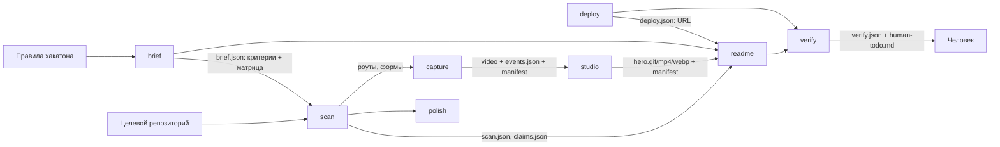

# repokit — DESIGN (M0)

Статус: **черновик на одобрение**. Кода и зависимостей ещё нет.
Дата: 2026-10-01. Репозиторий: `github.com/ArabKustam/Encilada-SEO-Github`.

> Пометка **[ДОПУЩЕНИЕ Qn]** означает: решение принято по моему рекомендованному варианту
> вопроса n из раздела 12 и меняется, если ответ будет другим.

---

## 1. Что это и чем не является

repokit — набор независимых CLI-сервисов и один skill для Claude Code, которые превращают
проект в аккуратно оформленный репозиторий (изначально — хакатонный; с раздела 13 — любой): разбор правил → аудит → README → правки
читаемости → деплой → запись демо → монтаж → проверка с чистого клона.

Не является: генератором «красивой неправды». Каждое утверждение в README привязано к
`файл:строка`, каждый медиафайл — к записи происхождения. То, что привязать нельзя, не пишется,
а уходит в список «для человека».

### Разделение труда: CLI ↔ Claude **[ДОПУЩЕНИЕ Q2]**

Сервисы **детерминированы и не вызывают LLM**: ни API-ключей, ни сети без флага. Всё, что требует
суждения (понять критерии жюри, сформулировать тэглайн, написать докстринг), делает Claude Code,
который и так запущен у пользователя. Сервисы дают ему факты, шаблоны и **валидаторы**:

| Делает CLI | Делает Claude (по SKILL.md) |
|---|---|
| извлекает текст правил, находит роуты/точки входа, считает размеры, рендерит кадры | заполняет матрицу критериев, пишет формулировки, черновик сценария демо |
| проверяет: схема валидна, `файл:строка` существует и совпадает с цитатой, ссылка жива | решает, что важно показать, и объясняет человеку выбор |
| отказывает (exit 1), если утверждение без доказательства | исправляет и вызывает проверку снова |

Следствие: результат можно воспроизвести и протестировать без модели, а честность держится на
проверках в коде, а не на «обещании» в промпте.

---

## 2. Стек и обоснование

| Область | Выбор | Почему |
|---|---|---|
| Язык | TypeScript (strict), ESM, Node ≥ 20 | один рантайм на всё; Playwright и Remotion и так требуют Node |
| Монорепо | pnpm workspaces | уже стоит у пользователя (pnpm 12, Node 22) |
| `scan` | **TypeScript, не Python** **[ДОПУЩЕНИЕ Q1]** | папки `hackseo/` в проекте нет — портировать нечего; второй рантайм усложнил бы установку |
| CLI | `commander` (MIT) | маленький, без магии |
| Схемы | JSON Schema 2020-12 в `schemas/` — источник истины; `ajv` для валидации; TS-типы генерируются из схем | контракт читается и людьми, и Claude, и тестами |
| Конфиги | `yaml` (ISC) | сценарии capture, `repokit.config.yaml` |
| Разбор кода | детекторы фреймворков (эвристики по файлам и AST) + `ts-morph` для TS/JS; для остальных языков — лёгкие regex-детекторы с пометкой `confidence` | tree-sitter добавим в M8, если эвристик не хватит |
| Запись веба | Playwright (Apache-2.0), Chromium | см. §6.6 |
| Монтаж | **Remotion + @remotion/three + react-three-fiber + drei** **[ДОПУЩЕНИЕ Q3]** | см. §2.1 |
| Кодирование | системный `ffmpeg` (проверяем наличие, не ставим) | GIF через `palettegen/paletteuse`; **gifski не используем — AGPL** |
| Тесты | `vitest`, `pixelmatch` (ISC) для кадров | |
| Логи | JSON Lines в `.repokit/logs/`, человеку — короткий текст в stderr | |

### 2.1. Remotion: за и против

За: детерминированный покадровый рендер, параллельные воркеры, готовое извлечение точных кадров
из видео (`OffthreadVideo`), официальная связка с three.js, CLI и Node API. Писать это самим —
несколько недель и собственные баги синхронизации.

Против — **лицензия**. Remotion не open source: бесплатно для частных лиц, некоммерческих
организаций и компаний до 3 сотрудников, остальным нужна платная лицензия. Для хакатонных команд
это обычно бесплатно, но ограничение есть, и оно распространяется на пользователей repokit.

Решение: Remotion — рендерер по умолчанию, но **за интерфейсом**. Вход студии — `timeline.json`,
сцены пресетов — обычные r3f-компоненты, получающие `frame`/`fps` пропсами и не импортирующие
Remotion напрямую. Запасной рендерер (Playwright открывает страницу со сценой, время виртуальное,
кадры источника заранее разложены ffmpeg в картинки, скриншот каждого кадра → ffmpeg) можно
добавить позже без переписывания пресетов. Условие лицензии выносится в README и `ATTRIBUTION.md`,
а `repokit studio` при первом запуске печатает одну строку-напоминание.

---

## 3. Структура репозитория

```
repokit/
  SKILL.md                    # skill, ≤ 200 строк
  .claude/commands/repokit.md # slash-команда /repokit
  .claude-plugin/plugin.json  # установка как плагин Claude Code  [ДОПУЩЕНИЕ Q5]
  packages/
    core/        # контракт CLI, коды выхода, логгер, ajv, .repokit/, provenance, redaction
    cli/         # бинарь `repokit`: диспетчер + `run`
    brief/  scan/  readme/  polish/  deploy/  capture/  verify/
    preview/     # локальный веб-интерфейс предпросмотра README + снимки для Claude
    studio/      # Remotion-проект, 2D-стили, движок слотов
  presets/
    3d/<name>/{preset.json, Scene.tsx, preview.gif}
    readme/<name>/{preset.json, template.md}
  schemas/       # *.schema.json
  examples/      # static-site/, web-app/ (FastAPI), web-app-node/, cli-tool/
  docs/          # по файлу на сервис + presets.md
  tests/e2e/  tests/snapshots/
  ATTRIBUTION.md  CONTRIBUTING.md  README.md  DESIGN.md
```

Каждый сервис — пакет с `bin`, запускается и отдельно, и через `repokit <service>`.
`studio` — самый тяжёлый пакет (Chromium + Remotion); он **необязательная зависимость**: `scan`,
`readme`, `verify` работают без него.

---

## 4. Общий контракт

- `repokit <service> <command> [flags]`. `--json` → в stdout ровно один JSON-документ; всё прочее в stderr.
- Общие флаги: `--repo <path>` (по умолчанию cwd), `--dry-run`, `--json`, `--yes` (только для шагов без необратимых действий), `--verbose`.
- Коды выхода: `0` ок · `1` проверка не пройдена · `2` ошибка использования · `3` нужен человек.
- Конверт ответа (`schemas/envelope.schema.json`):

```json
{ "service": "scan", "command": "audit", "version": "0.1.0", "ok": true,
  "exitCode": 0, "data": {}, "warnings": [], "humanTodo": [], "artifacts": [] }
```

- Артефакты: `.repokit/` в целевом репозитории. При первом запуске repokit **предлагает** добавить
  `.repokit/` в `.gitignore` (это изменение файла пользователя — через `--dry-run`/подтверждение).
- Идемпотентность: артефакты адресуются по хэшу входов; повторный запуск с теми же входами ничего не переписывает.
- Сеть: по умолчанию выключена. Включают её только явные флаги (`brief --url`, `verify --online`, `deploy run`, `preview --github-api`).
  Локальный сервер `preview` слушает только `127.0.0.1`.
- Маскирование: единый модуль `core/redact` прогоняет все логи и JSON через фильтр значений из env
  и известных шаблонов токенов. Секрет нельзя напечатать, даже если сервис попытается.

### `.repokit/`

```
.repokit/
  brief.json  scan.json  claims.json  readme.plan.json  deploy.json  verify.json
  human-todo.md               # сводный чек-лист «человеку»
  state.json                  # прогресс `repokit run`: какие шаги одобрены
  capture/<run-id>/{video.mp4, events.json, shots/*.png, scenario.yaml}
  media.manifest.json         # provenance всех медиа
  polish/patches/NN-<group>.patch
  logs/*.jsonl
```

---

## 5. Схемы данных между сервисами



Ключевые документы (поля сокращены до существенных):

**`brief.json`**
```json
{ "source": {"kind": "file|url|text|default-profile", "ref": "...", "sha256": "..."},
  "isDefaultProfile": false,
  "criteria": [{"id": "innovation", "title": "...", "weight": 0.3, "quote": "дословная цитата из правил"}],
  "submission": [{"id": "video", "required": true, "constraint": "≤ 3 мин", "quote": "..."}],
  "deadlines": [], "restrictions": [{"id": "ai-code", "quote": "..."}],
  "matrix": [{"criterionId": "innovation", "evidenceKinds": ["feature", "demo-scene"], "readmeSlot": "features"}] }
```
Каждый критерий и ограничение несёт `quote` — дословный фрагмент исходника; `brief validate`
проверяет, что цитата действительно есть в тексте правил. Выдуманный критерий не пройдёт.

**`scan.json`** — `project` (тип, стек, менеджер пакетов, команды запуска/тестов), `entrypoints`,
`routes[]`, `models[]`, `keyFiles[]` (с причиной важности), `mocks[]` (заглушки, захардкоженные
ответы, `TODO`), `repoHealth` (лицензия, размер, мусор, большие файлы), `audit[]` (замечания с severity).

**`claims.json`** — мост между фактами и текстом:
```json
{ "claims": [{ "id": "c1", "text": "JWT-авторизация",
    "status": "implemented|partial|mock|unverified",
    "evidence": [{"file": "app/auth.py", "lines": [12, 40], "snippetSha256": "..."}],
    "source": "readme|scan|claude" }] }
```
`snippetSha256` — хэш указанных строк. Код изменился → доказательство «протухло» → `verify` падает.
В README попадают только `implemented` и (с пометкой) `partial`; `mock` и `unverified` — в Limitations.

**`events.json`** (capture → studio) — `{ t, type: click|type|scroll|hover|move|mark|nav, x, y, target: {selector, box}, viewport }`,
время — по тем же меткам, что и кадры видео. Текст ввода не пишется, только длина.

**`media.manifest.json`** — на каждый файл: `sha256`, `kind`, `createdAt`, `tool` + версии,
`source: {scenario, scenarioSha256, baseUrl, targetCommit, runId}`, `derivedFrom: [sha256…]`,
`masks: [selector…]`, `demoData: bool`. Выходы `studio` ссылаются на входы через `derivedFrom` —
получается цепочка от кадра в README до сценария и коммита.

**`timeline.json`** — `output {width, height, fps, formats[]}`, `style`, `scenes[]`
(`source` → путь из манифеста, `in/out`, `speed`, `zoom: auto|keyframes`, `cursor`, `title?`, `transition`)
либо `preset` + `slots{}` для 3D.

**`preset.json` (3D)** — как в ТЗ: `name, description, durationInFrames, fps, aspectRatios[]`,
`slots[] {id, type, mesh, fit, aspect}`, `camera.keyframes[]`, `lights[]`, `background`.

---

## 6. Сервисы

### 6.1 brief
`extract` (файл/URL/текст → чистый текст + sha256; URL только с `--url`) → Claude заполняет
`brief.json` → `validate` (схема + проверка цитат) → `matrix` (печатает таблицу критерий → слот README → вид доказательства).
Нет правил — `brief init --default` ставит профиль по умолчанию с `isDefaultProfile: true`, и это
видно в отчёте и в `human-todo.md`.

### 6.2 scan
Команды: `audit`, `context`, `init`, `topics` (по описанию прототипа — см. Q1), плюс `keyfiles`,
`claims extract` (утверждения из текущего README), `claims check` (проверка доказательств).
Детекторы v1: статический сайт, Node (Express/Fastify/Next), Python (FastAPI/Flask/Streamlit/Gradio),
CLI (bin/entry_points), Docker. Каждый результат детектора имеет `confidence`; низкая уверенность →
Claude читает файл сам и подтверждает.

### 6.3 readme
`presets list` · `plan` (→ `readme.plan.json`: слоты, чем заполнены, чего не хватает) · `apply`
(запись; `--dry-run` показывает diff) · `check` (не осталось ли `<!-- FILL -->`).
Пресеты `compact`, `showcase`, `technical` = `template.md` со слотами + `preset.json`.
Правила заполнения: Features — только из `claims.json` со ссылкой на файл; бейджи — только
проверяемые (лицензия, CI, язык, деплой-URL); никаких бейджей со звёздами/скачиваниями-заглушками.
Медиа — через `<picture>` с `prefers-color-scheme`, с alt-текстом. Существующий README не затирается:
`apply` пишет в новую ветку/показывает diff, пользовательские секции вне слотов сохраняются.

**Язык.** README генерируется **на русском** (по умолчанию `language: ru` в `repokit.config.yaml`;
`en` — переключаемо, двуязычный вариант `README.md` + `README.en.md` со ссылками-переключателями — опция).
Заголовки секций и служебные фразы пресетов лежат в `presets/readme/<name>/i18n/{ru,en}.yaml`,
а не зашиты в шаблон. Собственный README repokit — тоже на русском.

Особенность GitHub, которую закладываем сразу: `<video>` в README проигрывается только по ссылке
`user-attachments`, получаемой перетаскиванием файла в веб-редактор. Поэтому герой README — GIF/WebP,
MP4 — ссылкой, а «загрузить видео через веб-интерфейс» — пункт в чек-листе человеку.

Развитие сервиса — раздел 13: структура README выбирается по типу проекта, пресеты остались как фиксированные шаблоны.

### 6.4 polish
`plan` (группы правок с обоснованием) → `propose <group>` (патч в `.repokit/polish/patches/`) →
человек смотрит → `apply <group>` → `revert <group>`.
Гарантии: работа в отдельной ветке `repokit/polish`; тесты запускаются до и после, результаты
сравниваются; **нет тестов → допускаются только комментарии, докстринги и README в папках**.
Переименования — только через семантический инструмент (`ts-morph` для TS/JS; для Python — `rope`,
если установлен, иначе переименования недоступны). Патч, меняющий > N строк без семантической причины
(т.е. переформатирование), отклоняется. История git не переписывается: только новые коммиты.

### 6.5 deploy
`detect` → `plan` (провайдер + генерируемые файлы + предупреждения тарифа) → `apply` (пишет конфиг/workflow,
с diff) → `run` (деплой, **только после подтверждения**) → `check` (health-check URL с ретраями на холодный старт).

| Тип проекта | Первый выбор | Запасной | О чём предупреждаем |
|---|---|---|---|
| Статика | GitHub Pages (Actions) | Cloudflare Pages | публичный репо для бесплатных Pages |
| Node/SSR | Vercel | Netlify, Render | лимиты функций |
| Python API | Render | Fly.io, HF Spaces (Docker) | сон после простоя, холодный старт 30–60 с |
| Streamlit/Gradio | HF Spaces | Streamlit Community Cloud | сон, публичность |
| Docker | Fly.io | Render | у Fly нужна карта |

Авторизация: проверяем `gh auth status`, `vercel whoami` и т.п. Нет CLI или входа → exit 3 с точной
командой для человека. (На машине разработки `gh` сейчас не установлен — этот путь будет проверен первым.)
Секреты — только именами: repokit говорит «задайте `X` в Secrets», значения не читает.

### 6.6 capture
`scenario draft` (из `scan.json` → черновик YAML) · `scenario validate` · `run` · `shots`.

Сценарий:
```yaml
baseUrl: http://localhost:8000
start: { command: "uvicorn app.main:app", readyUrl: "/health" }   # опционально
auth:  { storageState: ${env:DEMO_STORAGE_STATE} }
mask:  ["[data-secret]", "input[type=password]", ".api-key"]
demoData: true
pace: human
steps:
  - goto: /
  - click: "text=Sign in"
  - type: { selector: "#email", text: ${env:DEMO_EMAIL} }
  - mark: home          # → скриншот во всех размерах/темах
  - scroll: { to: "#pricing" }
```

Технические решения:
- **Качество видео.** Встроенный `recordVideo` Playwright даёт мягкую картинку и не учитывает DPR.
  **Итог спайка M2:** CDP-скринкаст тоже отвергнут — он игнорирует `deviceScaleFactor` и выдаёт ~13 к/с.
  Реализован цикл скриншотов `Page.captureScreenshot` с `clip.scale`: кадры в разрешении устройства, 25–45 к/с,
  метка времени — середина между запросом и ответом; сборка в CFR-видео через ffmpeg.
- **Браузер.** CDN со сборками Chromium для Playwright доступен не везде, поэтому `capture` и `studio` умеют работать
  с установленным Chrome или Edge (порядок: `REPOKIT_BROWSER` → сборка Playwright → системный браузер).
- **Курсор.** В headless-записи системного курсора нет — это плюс: движения мыши идут по
  сглаженной кривой, пишутся в `events.json`, а курсор рисует `studio`.
- **Маскирование** применяется до первого кадра (CSS-инъекция: блюр/заливка) и повторяется после
  навигаций; `input[type=password]` маскируется всегда. Значения `${env:…}` в логи и `events.json` не попадают.
- **Честность.** Записывается только реальное приложение по `baseUrl`. В манифест идут коммит
  целевого репо и хэш сценария. Перехват сети/подмена ответов в сценарии не поддерживаются вообще.
- CLI-демо (vhs/asciinema), Android, iOS, десктоп — M8.

### 6.7 studio
`presets list|preview` · `render` (по `timeline.json` или `--preset … --slot id=path`) · `optimize`.

2D: фон (градиент/мягкий шум), окно-рамка без чужих логотипов, тень, скругления. Авто-зум: события
кластеризуются по времени и месту → области интереса → ключевые кадры камеры с ease-in-out и
ограничением скорости; между кластерами камера возвращается к общему плану. Курсор — сглаживание
траектории + ripple на клик. Стили `light`, `dark`, `glass`. Эффекты воспроизводятся своими
средствами; код Recordly не открывается и не копируется.

3D: движок слотов загружает пресет, проверяет `--slot` против `preset.json`, строит текстуры
(`fit: cover|contain`, предупреждение при несовпадении пропорций), рендерит. Устройства —
процедурные (скруглённые боксы, материалы). Слот без медиа → exit 2; медиа вне манифеста →
предупреждение «происхождение неизвестно» и пометка в выходном манифесте.

Оптимизация GIF до бюджета: лестница `ширина → fps → палитра → длительность (с предупреждением)`,
останавливаемся на первом варианте ≤ 8 МБ; параллельно WebP, MP4 (H.264, yuv420p) и PNG-постер.

### 6.8 verify
`git clone` во временную папку → проверки: Quick start выполняется; ссылки и картинки README живы
(`--online` для внешних); файлы, на которые ссылается README, существуют; бюджеты медиа; скан секретов
(встроенные правила + `gitleaks`, если установлен); мусор (`node_modules`, `.env`, `__pycache__`, большие
бинарники); `claims.json` не протух; у медиа из README есть provenance; деплой-URL отвечает 200; нет `<!-- FILL -->`.
Команды Quick start — это выполнение чужого кода: перед запуском показываются человеку, есть таймауты,
`--no-exec` пропускает шаг. Выход: `verify.json` + обновлённый `human-todo.md`.

### 6.9 preview — веб-интерфейс предпросмотра README

Один инструмент для двух зрителей: человек смотрит в браузере, Claude — через снимки и JSON.

**Для человека:** `repokit preview serve` поднимает локальный сервер (только `127.0.0.1`, без внешних
запросов) и открывает страницу:

- **Центр — README как на GitHub:** GFM, таблицы, сворачиваемые секции, mermaid, `<picture>`,
  якоря, alert-блоки. Применяются те же ограничения, что у GitHub (вырезаются `style`, скрипты,
  неразрешённые теги), чтобы не увидеть в превью то, чего не будет на сайте.
- **Переключатели:** светлая/тёмная тема (проверка `<picture>`), ширина desktop/mobile,
  пресет `compact | showcase | technical` — сравнение без записи в файл, режим «было / стало» (diff с текущим README).
- **Боковая панель:** слоты пресета (заполнен / пуст / ждёт человека); по клику на утверждение —
  его доказательство `файл:строка` с фрагментом кода; вес каждого медиафайла против бюджета и его
  происхождение; битые ссылки; чек-лист `human-todo.md`.
- **Поля для человека:** тэглайн, Problem, команда, лицензия заполняются формой прямо в интерфейсе.
  Значения пишутся в `.repokit/readme.human.yaml` — источник, из которого `readme apply` берёт
  «человеческие» слоты. Сам `README.md` интерфейс не меняет: запись — только кнопкой «Применить»,
  которая показывает diff и выполняет тот же `readme apply`.
- **Живое обновление:** правка `README.md`, плана или медиа сразу перерисовывает страницу (SSE).

**Для Claude:** `repokit preview shot --theme light|dark --width 1280|390 --out .repokit/preview/`
рендерит ту же страницу без интерфейса и сохраняет PNG (целиком и по секциям) — Claude смотрит
картинку и видит README глазами оценщика. `repokit preview check --json` отдаёт измеримое:
высота первого экрана и что в него попало, изображения шире колонки, пустые слоты, слишком длинные
строки таблиц, отсутствие alt, несработавший mermaid. Плюс `--json`-версия всего, что показывает панель.

**Точность рендера.** По умолчанию — локальный рендер (`markdown-it` + правила очистки GitHub +
открытые стили `github-markdown-css`), работает офлайн. Флаг `--github-api` рендерит через
официальный Markdown API GitHub — пиксельно точно, но это сетевой запрос с текстом README,
поэтому только по явному флагу.

**Стек:** `node:http` + SSE, страница — небольшой клиент без тяжёлого фреймворка; снимки — Playwright,
который уже есть в `capture`. Отдельный пакет `packages/preview`.

**Как реализовано в M4:** режима `--github-api` нет — только локальный рендер. Словари заголовков общие для всех пресетов
(`presets/readme/_i18n/`), а не свои у каждого. Двуязычный вариант `README.md` + `README.en.md` не сделан: язык один на запуск.

### 6.10 run (оркестрация)
`repokit run [path]` идёт по шагам `brief → scan → deploy → capture → studio → readme → polish → verify`,
сохраняя прогресс в `state.json`. Каждый шаг с последствиями — ворота: CLI возвращает exit 3 с
описанием, что требуется одобрить; Claude показывает это человеку и продолжает `repokit run --approve <step>`.
Любой шаг можно пропустить (`--skip deploy`) — пропуск отражается в `human-todo.md`.
Порядок `deploy` раньше `capture` — чтобы при желании снимать демо с боевого URL.

---

## 7. Честность, зашитая в механику

| Принцип | Чем обеспечен |
|---|---|
| Только правда | `claims.json` с хэшами фрагментов; `readme apply` отказывается вставлять утверждение без доказательства |
| Не обманывать оценщиков | `verify` ищет в README/коде скрытый текст (HTML-комментарии с обращением к ревьюеру, `display:none`, нулевой размер/цвет фона, zero-width символы); команд, меняющих историю git, в repokit нет |
| Упаковка ≠ подмена | слоты принимают только файлы; provenance-цепочка; capture без подмены сети |
| Безопасность | `core/redact`, маски в кадре, секреты только по имени env, exit 3 вместо попытки логина |
| Человек решает | ворота в `run`, патчи `polish`, `--dry-run` везде, отдельная ветка |

---

## 8. Автоматика и человек

**Автоматически:** аудит, матрица, структура README, бейджи, mermaid-схема, генерация конфигов деплоя,
запись и монтаж демо, оптимизация медиа, проверка с клона.

**Всегда человек:** одобрение сценария демо, каждого патча `polish`, деплоя и пуша; логины в CLI;
создание тестового аккаунта; состав команды, тэглайн и Problem (Claude предлагает, человек подтверждает);
выбор лицензии; загрузка MP4 в README через веб-интерфейс GitHub; отправка заявки на хакатон.

---

## 9. Кроссплатформенность

| Возможность | Windows | macOS | Linux |
|---|---|---|---|
| brief / scan / readme / polish / verify | ✅ | ✅ | ✅ |
| preview (веб-интерфейс, снимки) | ✅ | ✅ | ✅ |
| capture web (Playwright) | ✅ | ✅ | ✅ (в CI — headless) |
| studio 2D/3D (Remotion) | ✅ | ✅ | ✅ (нужны системные библиотеки Chromium) |
| capture CLI (vhs) | ⚠️ vhs на Windows нестабилен → asciinema/WSL | ✅ | ✅ |
| capture Android (adb) | ✅ | ✅ | ✅ |
| capture iOS (simctl) | ❌ | ✅ | ❌ |
| capture desktop | M8, по-разному на каждой ОС | | |

Основная машина разработки — Windows 10 (Node 22, pnpm 12, Python 3.11, ffmpeg 8.1 есть; `gh` нет).
Пути — через `node:path`, команды — без shell-специфики, в CI — матрица из трёх ОС.

---

## 10. Риски

| Риск | Смягчение |
|---|---|
| Качество/синхронизация записи Playwright | спайк в первый день M2: скринкаст против `recordVideo`, замер рассинхрона событий и кадров; критерий — ≤ 1 кадра |
| Флак сценариев | авто-ожидания Playwright, `readyUrl`, ретрай шага, при падении — трейс и скриншот в `.repokit/` |
| WebGL-рендер отличается между ОС/GPU | снапшоты эталонятся в Linux CI на программном GL; локально — увеличенный допуск |
| Скорость 3D-рендера на CPU | пресеты ≤ 6–8 с, параллельные воркеры, `--draft` (половинное разрешение) |
| Вес GIF | лестница оптимизации, WebP как основной формат в `<picture>`, GIF — запасной |
| Лицензия Remotion | рендерер за интерфейсом, явное уведомление, запасной путь описан в §2.1 |
| Лимиты бесплатных тарифов | предупреждения в `deploy plan`, health-check с ожиданием холодного старта, пометка в README |
| `verify` выполняет чужие команды | показ перед запуском, таймауты, `--no-exec` |
| Секрет в кадре | маски по умолчанию для password-полей, обязательный просмотр сценария человеком, скан кадров на шаблоны токенов по DOM-тексту до записи |
| Эвристики `scan` ошибаются | `confidence`, проверка Claude, всё спорное — в `human-todo.md`, а не в README |
| Раздувание объёма | `studio` — опциональная зависимость; вехи с жёсткими критериями приёмки |

---

## 11. Тестирование

- **Unit:** парсеры, детекторы, валидаторы схем, `redact`, алгоритм авто-зума (вход — `events.json`, выход — ключевые кадры), лестница оптимизации.
- **Схемы:** каждый пример из `schemas/examples/` валиден; каждый сервис в e2e отдаёт валидный конверт.
- **E2E на фикстурах:** `static-site`, `web-app` (FastAPI), `web-app-node`, `cli-tool`. В фикстурах специально заложены: мок-эндпоинт, ложное утверждение в README, битая ссылка, фальшивый секрет, скрытая инструкция для LLM — repokit обязан всё это найти.
- **Тесты честности:** `readme apply` с утверждением без доказательства → exit 1; медиа без манифеста → предупреждение; секрет из env не встречается ни в одном артефакте (grep по `.repokit/`).
- **Визуальные снапшоты:** 3 кадра на пресет (начало/середина/конец), `pixelmatch` с допуском.
- **CI:** GitHub Actions, матрица ubuntu/windows/macos × Node 20/22; lint, typecheck, unit, e2e без studio на всех ОС, studio — на ubuntu.

### Приёмка вех

| Веха | Готово, когда |
|---|---|
| M1 | `repokit scan audit examples/web-app --json` отдаёт валидный `scan.json`; CI зелёный на 3 ОС |
| M2 | `examples/web-app` → `hero.gif` ≤ 8 МБ с авто-зумом и манифестом |
| M3 | `studio render --preset laptop-orbit|phone-float|browser-tilt` + снапшоты |
| M4 | `readme plan/apply` на фикстуре, README на русском; ложное утверждение не попадает в README; `preview serve` показывает README в обеих темах с панелью слотов, `preview shot` отдаёт PNG |
| M5 | `verify` ловит все заложенные в фикстуры дефекты |
| M6 | `static-site` деплоится на Pages через сгенерированный workflow, health-check 200 |
| M7 | патч с докстрингами применяется и откатывается, тесты до/после совпадают |
| M8 | оставшиеся пресеты и источники записи |

---

## 12. Вопросы и принятые допущения

| # | Вопрос | Рекомендация (принята как допущение) |
|---|---|---|
| Q1 | Папки `hackseo/` в проекте нет. Есть ли прототип? | Если есть — положите в `repokit/hackseo/`, портирую логику. Пока: `scan` пишется на TypeScript с нуля по описанию команд |
| Q2 | Вызывают ли сервисы LLM сами? | Нет: детерминированные CLI, «мозг» — Claude Code. Без API-ключей |
| Q3 | Remotion при его лицензии (бесплатно для частных лиц и команд ≤ 3) подходит? | Да, за интерфейсом, с уведомлением. Альтернатива — свой рендерер на Playwright: +1–2 недели к M2 |
| Q4 | Где живёт проект и какой репозиторий? | Подпапка `encilada/repokit/` → `ArabKustam/Encilada-SEO-Github`, ветка `main`, пуш после каждой вехи |
| Q5 | Как ставится skill? | Корневой `SKILL.md` + манифест плагина Claude Code + `/repokit`; публикация в npm — позже, под scope (имя `repokit` в npm, вероятно, занято) |
| Q6 | Язык документации | **Решено пользователем:** README — на русском (и генерируемый, и самого repokit); язык переключается в конфиге |
| Q9 | Что умеет веб-интерфейс предпросмотра? | **Запрошен пользователем.** Допущение по объёму: просмотр «как на GitHub», темы/ширина/пресеты, панель слотов и доказательств, форма для «человеческих» полей, кнопка «Применить» через diff. Полноценного редактора Markdown в v1 нет. Появляется в M4 вместе с `readme` |
| Q7 | Лицензия самого repokit | MIT |
| Q8 | Приоритет ОС и сценариев | Windows — основная, веб-демо — главный сценарий; CLI/мобильные/десктоп — M8, как в ТЗ |

---

## 13. README как презентация проекта

Дата: 2026-10-02. Цель сместилась: не «подать проект жюри», а сделать так, чтобы человек, впервые открывший
репозиторий, за минуту понял, что это, для кого, что умеет и как попробовать. Принципы честности (раздел 7) не меняются.
Разбор правил хакатона (`brief`) и раздел «Для жюри» остаются, но включаются только когда есть `brief.json`.

### 13.1 Что показал разбор 25 README

Выборка — ухоженные открытые проекты разных типов (CLI, библиотеки, веб-приложения, инструменты, ИИ). Измерено скриптом:

| Показатель | Значение |
|---|---|
| Длина | медиана 164 строки, 905 слов |
| Разделов второго уровня | медиана 6 |
| Бейджей в начале | медиана 3 (всего в файле — 4) |
| Изображение до первого раздела | 24 из 25 |
| Шапка по центру | 18 из 25 |
| `<details>` | 4 из 25 |
| Изображения под светлую и тёмную тему | 10 из 25 |
| Mermaid | 0 из 25 |
| Эмодзи в заголовках | 0 из 25 |

Выводы: хороший README короткий; первый экран — название, одна фраза, картинка, пара бейджей и ссылки; украшений мало.
Mermaid и `<details>` — редкие инструменты, а не обязательные. Отсюда пороги аудита (`LIMITS` в `packages/readme/src/audit.ts`).

Готовые инструменты (генераторы README из шаблонов, линтеры Markdown, проверка ссылок) закрывают отдельные части,
но не связывают текст с кодом: не знают, какой пример настоящий и какие переменные окружения читает программа.
Новых зависимостей не добавлено: всё построено на `scan`, `ffmpeg` и уже имеющихся пакетах.

### 13.2 Что было и чего не хватало

| № | Требование | Было | Стало |
|---|---|---|---|
| 1 | Структура по типу проекта | три фиксированных пресета под хакатон | `detectProfile` + `STRATEGIES`: 14 типов, решение с фактами и уверенностью |
| 2 | Правила текста | запрет непроверенных утверждений | + аудит рекламных слов и неизмеренных качеств (ru, en), правила в SKILL.md |
| 3 | План до генерации | `readme.plan.json` после сборки | `readme layout` → `readme.layout.json`, редактируемый |
| 4 | Первый экран | `preview check` (что видно на первом экране) | `readme hero-check` по тексту, без браузера |
| 5 | Скриншоты | `capture shots` по меткам сценария | + `capture screenshot` без сценария; поиск повторов в `assets check` |
| 6 | Демо | `capture run` + `studio render` для веба | + `capture terminal` для CLI; библиотекам демо не предлагается |
| 7 | Медиафайлы | бюджет медиа в `verify` | сервис `assets`: check, optimize, prune, normalize, convert |
| 8 | Таблицы | — | аудит: таблица от трёх строк, не шире шести колонок; генератор следует тому же |
| 9 | Реальные примеры | — | `examples extract` с файлом, строками и хешем |
| 10 | Проверка Quick Start | `verify run --exec` в чистом клоне | + `readme verify-quickstart`; аудит переменных окружения, о которых README молчит |
| 11 | Схема архитектуры | Mermaid до 12 файлов | `diagram architecture`: ≤ 8 блоков, свёртка в папки, пакеты монорепозитория |
| 12 | Возможности GitHub | `<picture>`, `<details>`, центрирование | + строка ссылок в шапке, якоря; HTML только там, где Markdown не умеет |
| 13 | Светлая и тёмная тема | `--hero-dark`, снимки `preview` в обеих темах | + проверка прозрачных PNG; терминал и скриншот в двух темах |
| 14 | Сворачиваемые разделы | опция `collapsible` в пресете | по размеру раздела; запуск и установка не сворачиваются |
| 15 | Аудит | `readme check`, `preview check` | `readme audit`: 8 категорий, ✓/✗, код выхода; `--fix` для разметки |
| 16 | Стили | три пресета | шесть стилей: minimal, developer, product, showcase, research, docs |
| 17 | Приоритеты информации | обязательные слоты пресета | must / should / optional / omit с причиной у каждого раздела |
| 18 | Не перегружать | — | раздел без содержания не выводится; пороги длины и числа разделов в аудите |
| 19 | Существующий README | сохранение чужих разделов, резервная копия | режим `improve`: содержательный README не заменяется без `--regenerate` |
| 20 | Сквозной процесс | `run` | структура по типу проекта, шаг `audit`, хакатонные шаги только при наличии правил |

### 13.3 Как это устроено

```
scan ──► profile (тип, сигналы) ──► layout (план, приоритеты) ──► build (черновик) ──► audit (✓/✗)
          examples (код, команды)        ▲                                               │
          env (переменные окружения)     └── readme.layout.json — правит человек или Claude ┘
```

- `packages/readme/src/profile.ts` — правила определения типа; каждое правило даёт вес и факт. `STRATEGIES` — стартовая
  структура для каждого типа: стиль, читатель, главное действие, вид демо, разделы с приоритетом.
- `layout.ts` — из стратегии убирается всё, чему нечего показать (с причиной), добавляется то, что дал автор
  (проблема, решение, команда, разбор правил). Стиль отсекает приоритеты. Существующий README разбирается по разделам.
- `build.ts` — прежний сборщик по слотам; добавлены слоты `usage`, `commands`, `configuration`, `packages`.
  Пресет теперь может быть получен из плана (`presetFromLayout`), а может быть фиксированным шаблоном — код один.
- `audit.ts` — чистая функция от текста README, контекста и плана. Без сети и браузера, поэтому быстро и тестируемо.
- `examples.ts`, `scan/env.ts` — извлечение фактов. Значения переменных окружения и файлы `.env` не читаются.
- `packages/assets` — отдельный сервис: работает с любым репозиторием и не зависит от `readme`.

Совместимость: `--preset compact|showcase|technical` ведёт себя как раньше. По умолчанию теперь `auto`.
Схемы: `readme-layout`, `readme-audit`, `examples`.

### 13.4 План

**P0 — сделано в этой итерации**

- тип проекта, стратегии, стили, приоритеты разделов (`readme layout`, `--style`);
- разделы «Пример использования», «Команды», «Настройка», «Пакеты»; `git clone` и строка ссылок в шапке;
- `readme audit`, `readme hero-check`;
- `examples extract`, `diagram architecture`;
- режим улучшения существующего README;
- сервис `assets`;
- тесты и документация.

**P1 — сделано**

- `capture terminal`: настоящий запуск команды → SVG для светлой и тёмной темы, с записью о происхождении;
- `capture screenshot`: один снимок без сценария;
- `assets check` находит одинаковые и почти одинаковые изображения (`pixelmatch`);
- `readme audit --fix`: только разметка — заголовки, пустые строки, свёртка длинных блоков кода;
- аудит прозрачных PNG, которые не видны в одной из тем;
- `run`: шаг `audit`; шаги `brief`, `claims`, `demo` пропускаются сами, когда к проекту не относятся; для CLI демо — запись терминала;
- `readme verify-quickstart` (он же `verify quickstart`);
- примеры, команды и переменные окружения для Go (`cobra`) и Rust (`clap` builder).

**P2 — позже**

- автоматический выбор лучших 1–3 кадров (сейчас находятся только повторы);
- запись интерактивных программ в терминале и анимированная запись набора команды;
- `clap` в стиле derive, другие библиотеки разбора аргументов;
- запись мобильных и десктопных приложений (веха M8);
- двуязычный README с переключателем;
- таблицы совместимости из матрицы CI;
- сравнение «до и после» в `preview`;
- `polish` (веха M7).

Не планируется: таблицы сравнения с другими проектами, симуляция оценки жюри, числовой «рейтинг README».
Первое требует фактов, которых в репозитории нет; второе и третье подменяют понятность баллами.

---

## 14. Плагин Claude Code

Дата: 2026-10-02. Цель: поставить repokit один раз и пользоваться им в любом проекте, не клонируя репозиторий рядом
и не объясняя Claude, где что лежит. Формат сверен с актуальной документацией Claude Code (манифест плагина, каталог,
skills, MCP-серверы плагинов); подробное руководство — [docs/claude-code-plugin.md](docs/claude-code-plugin.md).

### 14.1 Разделение ответственности

```
Claude Code ──► skill readme        что делать и в каком порядке, когда спросить человека
            ──► MCP-сервер repokit  7 инструментов; каждый = команда CLI с --json
            ──► bin/repokit         CLI: вся логика
                    │
                    ▼
            целевой репозиторий: README, docs/assets, .repokit/
```

Логика есть только в CLI. Skill не содержит скриптов, MCP-сервер ничего не анализирует сам и не обходит защиту CLI.

### 14.2 Решения

| Вопрос | Решение | Почему |
|---|---|---|
| Где лежит плагин | папка `plugin/`, каталог — `.claude-plugin/marketplace.json` в корне с `"source": "./plugin"` | Claude Code копирует в кэш папку плагина; корень репозитория с медиа и исходниками туда не попадает |
| Как CLI попадает к пользователю | один файл `plugin/lib/repokit.mjs`, собранный esbuild и закоммиченный | установка плагина — это копирование файлов, сборка на машине пользователя не выполняется |
| Команда `repokit` | `plugin/bin/repokit` — Node-скрипт с shebang; папка `bin/` плагина попадает в PATH инструмента Bash | документированный механизм; работает при пробелах в пути |
| Медиа-сервисы | не входят в бандл; `repokit setup` ставит полную сборку в `~/.repokit/runtime/<версия>`, команды `capture`, `studio`, `preview` передаются ей | Playwright, Remotion и их бинарные зависимости (~1 ГБ) нельзя и незачем класть в плагин |
| Данные CLI | схемы и шаблоны README копируются в `plugin/resources/`; путь задаётся `REPOKIT_RESOURCES` | в бандле нет прежней структуры папок |
| MCP | собственный минимальный stdio-сервер без зависимостей, ~300 строк | протокол прост; SDK добавил бы зависимость ради трёх методов |
| Текущий проект | `CLAUDE_PROJECT_DIR`, затем `roots/list`, затем рабочая папка; можно передать `repo` | так его сообщает Claude Code; `process.cwd()` — последний вариант |
| Набор инструментов | 6 высокоуровневых и `run_repokit` как запасной выход | десятки мелких инструментов засоряют контекст каждой сессии |
| Публикация через MCP | `deploy run`, `release create`, `--confirm` отклоняются | публикация остаётся действием человека в терминале |
| Хуки | нет | ничего не должно запускаться само |
| Версия | корневой `package.json` → `VERSION` в core → `plugin.json`; сборка сверяет | одно число для CLI, MCP, плагина и метки релиза |

Отступление от исходного плана (раздел 3): корневой `SKILL.md` остался как инструкция для работы в рабочей копии,
а skill плагина написан заново — про использование в чужом репозитории, с подробностями в `references/`.

### 14.3 Что проверено

- `claude plugin validate` для плагина и для каталога;
- плагин, скопированный в отдельную папку с пробелом в пути: `--help`, `doctor`, `scan`, `readme layout/plan`, `run`;
- MCP по протоколу: `initialize`, `tools/list`, вызовы инструментов, определение проекта по `CLAUDE_PROJECT_DIR`,
  явный путь, ошибки CLI и неизвестные методы без разрыва соединения, отсутствие постороннего вывода в stdout;
- отказ медиа-команд с подсказкой до `setup` и передача их полной сборке после.

Не покрыто автоматическими тестами: выбор skill моделью по запросу в живой сессии и настоящая установка из GitHub —
это проверяется вручную (см. отчёт о проверке в описании изменений).

### Состояние вех

| Веха | Состояние |
|---|---|
| M1–M6 | готово; M6 принята — `examples/static-site` опубликован на GitHub Pages |
| README как презентация (раздел 13) | P0 и P1 готовы |
| Плагин Claude Code (раздел 14) | готово |
| M7 `polish`, M8 запись мобильных и десктопных приложений | не начаты |
