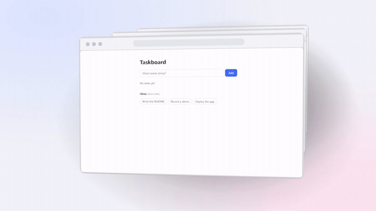
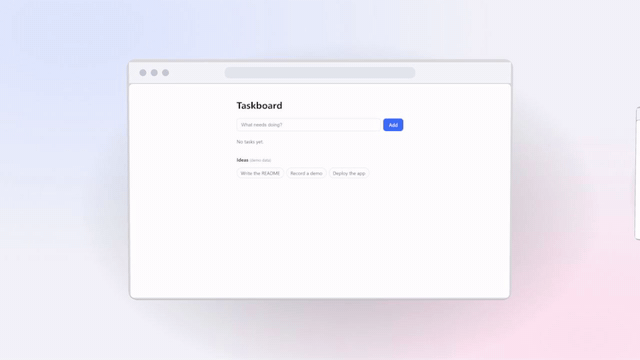
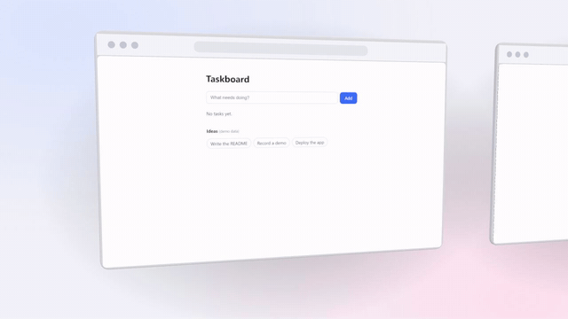
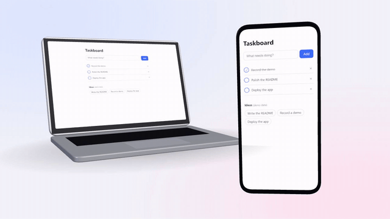
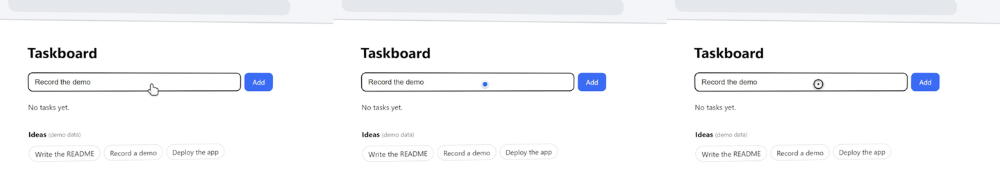
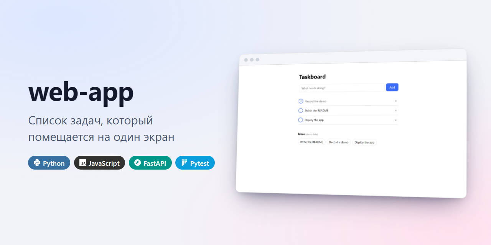
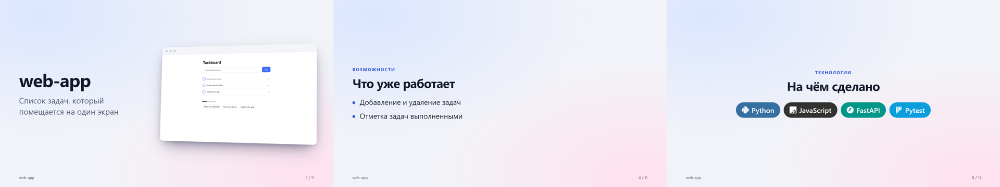
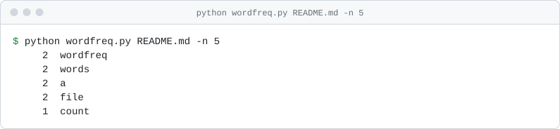

# repokit

Набор небольших CLI-сервисов и skill для Claude Code, которые превращают README репозитория в понятную презентацию проекта:
правильная структура под тип проекта, настоящие скриншоты и демо, примеры из самого кода, проверка первого экрана.

README, демо и документация показывают только то, что в проекте реально есть.
Поэтому repokit не «пишет красиво», а собирает факты из кода и проверяет каждое утверждение по `файл:строка`.

[Документация](docs/) · [Быстрый старт](#быстрый-старт) · [Как это устроено](DESIGN.md)

    

> **Статус: в разработке.** Работают анализ репозитория (`scan`), план, сборка и аудит README (`readme`), примеры и схема
> архитектуры из кода (`examples`, `diagram`), медиафайлы (`assets`), запись веб-демо (`capture`), монтаж (`studio`),
> веб-предпросмотр (`preview`), проверка с чистого клона (`verify`), деплой (`deploy`), релиз (`release`) и сквозной прогон (`run`).
> Запись мобильных и десктопных приложений и безопасные правки кода (`polish`) ещё не реализованы — см. [DESIGN.md](DESIGN.md).


*Этот ролик получен командами `capture run` и `studio render` из учебного приложения [examples/web-app](examples/web-app).
Список «Ideas» в кадре — демонстрационные данные самого приложения.*

## Галерея: что умеет инструмент

Всё ниже сделано командами repokit из двух учебных проектов этого репозитория — [examples/web-app](examples/web-app) и
[examples/cli-tool](examples/cli-tool). На экранах только настоящие записи и скриншоты; устройства нарисованы процедурно
и не изображают конкретные продукты.

### Несколько страниц в 3D

`studio scene make --template <имя> --pages a.png,b.png,c.png` собирает из скриншотов сцену, где страницы сменяют друг друга.

| `carousel` — соседние по бокам, ряд сдвигается | `stack` — стопка, верхняя улетает |
|---|---|
|  |  |

| `swap` — страницы меняются, разворачиваясь как двери | `wall` — камера едет вдоль ряда |
|---|---|
|  |  |

`duo` — десктопная версия на ноутбуке и мобильная на телефоне:



### Запись на экране устройства

`studio render --preset <имя> --slot main=<запись>`:

| `laptop-orbit` | `phone-float` | `browser-tilt` |
|---|---|---|
|  |  |  |

### Режиссёрская сцена: камера, подъём кнопок, искры

`studio render --scene <файл>`: камера по-настоящему подъезжает к каждому действию, нажатые кнопки приподнимаются
над страницей, от кликов летят искры. Движение описано в JSON-файле, который можно править.


Курсор в сцене — стрелка, рука, точка или кольцо (`"cursor": "hand"`):



### Разбор устройства проекта

`studio explain`: карточки модулей и связи между ними взяты из кода — импорты и обращения к API; камера идёт по пути запроса.


### Баннер и слайды

`studio banner`: название и тэглайн — слова автора, технологии найдены в зависимостях, справа настоящий скриншот.



`studio deck`: слайды из фактов о проекте, с PDF.



### Запись терминала

`capture terminal -- <команда>`: настоящий вывод команды, картинка для светлой и тёмной темы.

<picture>
  <source media="(prefers-color-scheme: dark)" srcset="docs/media/example-terminal-dark.svg">
  
</picture>

## Что уже работает

- **`readme layout`** — определяет тип проекта (веб-приложение, CLI, библиотека, SDK, API, ИИ-агент, мобильное, десктопное, игра, ML, инструмент разработчика, шаблон, монорепозиторий, инфраструктура) и планирует README до генерации: читатель, главное действие, разделы с приоритетом и причиной. План — JSON, его можно править. См. [docs/readme.md](docs/readme.md).
- **`readme audit`**, **`readme hero-check`** — проверяют README по восьми категориям: понятность, первый экран, визуалы, быстрый старт, примеры, утверждения, оформление, файлы. Без оценок: каждая строка — конкретная проверка. См. [packages/readme/src/audit.ts](packages/readme/src/audit.ts).
- **`examples extract`** — находит настоящие примеры использования в `examples/`, документации и тестах, а также команды и опции из `argparse`, `click`, `commander`, `cobra`, `clap`; копирует дословно, с файлом и строками. См. [packages/readme/src/examples.ts](packages/readme/src/examples.ts).
- **`diagram architecture`** — схема Mermaid по импортам в коде, не больше восьми блоков; в монорепозитории — по пакетам. См. [packages/readme/src/architecture.ts](packages/readme/src/architecture.ts).
- **`assets`** — битые ссылки на медиа, тяжёлые, неиспользуемые и повторяющиеся файлы, имена; сжатие и конвертация через `ffmpeg`. См. [docs/assets.md](docs/assets.md).
- **`capture terminal`**, **`capture screenshot`** — настоящий вывод команды картинкой для светлой и тёмной темы и одиночный скриншот страницы без сценария. См. [docs/capture.md](docs/capture.md).
- **`readme audit --fix`**, **`readme verify-quickstart`** — механические правки README без изменения текста и проверка команд запуска во временной копии.
- **`scan audit`** — определяет тип проекта и стек, команды установки, запуска и тестов, точки входа, роуты (FastAPI, Flask, Express, Next.js, статические страницы), модели данных, места, похожие на заглушки, и замечания по репозиторию (README, лицензия, `.gitignore`, тяжёлые и служебные файлы). См. [packages/scan/src/analyze.ts](packages/scan/src/analyze.ts).
- **`scan claims`** — извлекает утверждения из README, привязывает их к строкам кода и проверяет, что доказательство существует и код с тех пор не менялся. См. [packages/scan/src/claims.ts](packages/scan/src/claims.ts).
- **`scan context`**, **`scan topics`**, **`scan init`** — выжимка репозитория для модели, предложение GitHub topics, создание рабочей папки `.repokit/`.
- **`capture`** — запускает приложение и записывает по сценарию видео, лог событий и скриншоты в настоящем браузере; секреты берутся из окружения, поля с ними размываются. См. [docs/capture.md](docs/capture.md).
- **`studio`** — монтирует запись: фон, окно-рамка, авто-зум по кликам и вводу, сглаженный курсор; выдаёт MP4, GIF в пределах 8 МБ, WebP и постер. См. [docs/studio.md](docs/studio.md).
- **Режиссёрские сцены** — свои объекты, движение, камера к любой точке страницы, эффекты по кликам (подъём нажатого элемента, искры, кольца, 3D-курсор четырёх видов); пять готовых постановок для нескольких страниц; быстрая проверка одним кадром. См. [docs/scenes.md](docs/scenes.md).
- **Разбор архитектуры** — `studio explain` строит видео о том, как устроен проект: модули, сервисы, путь запроса; значки технологий. См. [docs/scenes.md](docs/scenes.md).
- **Звук и WebM** — щелчки на клики записи, ваша музыка, вывод в WebM. См. [docs/scenes.md](docs/scenes.md).
- **Баннеры и слайды** — картинки из фактов о проекте, с логотипами технологий; слайды собираются в PDF, баннер можно поставить в шапку README. См. [docs/studio.md](docs/studio.md).
- **`release`** — описание релиза из подтверждённых фактов и создание релиза на GitHub через ваш `gh`, если его ещё нет. См. [docs/release.md](docs/release.md).
- **Бейджи технологий** — раздел «Технологии» в README: `for-the-badge` с логотипами, только для найденного в коде. См. [docs/readme.md](docs/readme.md).
- **3D-пресеты** — ноутбук, телефон и окно браузера со слотами: выбираете пресет, указываете скриншот или запись, они встают на экран устройства. Пустой слот — ошибка; медиа не из `capture` — предупреждение. Как добавить свой — в [CONTRIBUTING.md](CONTRIBUTING.md).
- **`brief`** — сохраняет правила хакатона и проверяет, что каждый критерий в матрице подтверждён дословной цитатой из них; без правил — типовой набор с явной пометкой. См. [docs/brief.md](docs/brief.md).
- **`readme plan`**, **`readme apply`** — собирают README на русском (или английском) по плану: проверенные утверждения, пример и команды из кода, переменные окружения, слова автора; шесть стилей подачи. Содержательный README, написанный автором, не заменяется без `--regenerate`. См. [docs/readme.md](docs/readme.md).
- **`preview`** — показывает README как на GitHub: веб-интерфейс с темами, шириной, панелью разделов и формой для полей автора; для модели — снимки PNG и список измеримых проблем. См. [docs/preview.md](docs/preview.md).
- **`verify`** — клонирует репозиторий во временную папку и проверяет: README без пустых мест и битых ссылок, alt-тексты, бюджет медиа, секреты, скрытый текст и инструкции для автоматических проверяющих, служебные файлы; по флагам — внешние ссылки и выполнение команд Quick start. См. [docs/verify.md](docs/verify.md).
- **`deploy`** — подбирает бесплатную площадку под тип проекта, генерирует конфигурацию (workflow для GitHub Pages, `render.yaml`, `fly.toml`, `Dockerfile`), запускает деплой через ваш CLI только с явным подтверждением и проверяет, что сайт отвечает. См. [docs/deploy.md](docs/deploy.md).
- **`run`** — проводит через все шаги по порядку и останавливается на одобрение перед записью демо и README. См. [docs/run.md](docs/run.md).
- **`doctor`** — проверка внешних инструментов (git, ffmpeg, gh, python). Ничего не устанавливает.
- **Общий контракт** — единый JSON-конверт, коды выхода, `--dry-run`, идемпотентная запись, маскирование секретов в любом выводе. См. [packages/core/src](packages/core/src).

## Быстрый старт

Нужны Node.js 20+ и pnpm.

```bash
pnpm install
```

```bash
pnpm build
```

Аудит примера из репозитория (ничего не записывает):

```bash
node packages/cli/dist/bin.js scan audit --repo examples/web-app --dry-run
```

То же в машинном виде:

```bash
node packages/cli/dist/bin.js scan audit --repo examples/web-app --dry-run --json
```

Запись и монтаж демо того же примера. Нужны Google Chrome или Edge, `ffmpeg`, Python и зависимости примера
(`pip install -r examples/web-app/requirements.txt`):

```bash
node packages/cli/dist/bin.js capture run --repo examples/web-app --scenario examples/web-app/demo.scenario.yaml
```

```bash
node packages/cli/dist/bin.js studio render --repo examples/web-app --out docs/media/hero.mp4 --gif
```

Та же запись на экране 3D-ноутбука (подставьте имя папки записи из вывода `capture run`):

```bash
node packages/cli/dist/bin.js studio render --repo examples/web-app --preset laptop-orbit --slot main=.repokit/capture/<запись>/video.mp4 --out docs/media/hero-3d.mp4 --gif
```

План README для примера-утилиты: тип проекта, разделы и причина каждого решения (ничего не записывает):

```bash
node packages/cli/dist/bin.js readme layout --repo examples/cli-tool --dry-run
```

Запись настоящего запуска той же утилиты в картинку (покажет план; без `--dry-run` выполнит команду):

```bash
node packages/cli/dist/bin.js capture terminal --repo examples/cli-tool --dry-run -- python wordfreq.py --help
```

Аудит README самого repokit:

```bash
node packages/cli/dist/bin.js readme audit --dry-run
```

Черновик README для веб-примера и его предпросмотр в браузере:

```bash
node packages/cli/dist/bin.js readme plan --repo examples/web-app
```

```bash
node packages/cli/dist/bin.js preview serve --repo examples/web-app --open
```


Проверка репозитория с чистого клона и сквозной прогон примера (остановится и скажет, что нужно от вас):

```bash
node packages/cli/dist/bin.js verify run
```

```bash
node packages/cli/dist/bin.js run examples/web-app --default-brief
```

Тесты:

```bash
pnpm test
```

Сквозные тесты с настоящей записью, рендером и сравнением кадров 3D-пресетов с эталонами выключены по умолчанию
и включаются переменной `REPOKIT_E2E_MEDIA=1`.

## Настройка

Все переменные окружения необязательны.

- `REPOKIT_BROWSER` — путь к Chrome или Edge для записи и предпросмотра, если браузер не найден автоматически.
- `REPOKIT_GL` — движок WebGL для 3D-рендера; на машине без видеокарты — `swangle`.
- `REPOKIT_E2E_MEDIA` — `1` включает сквозные тесты с записью и рендером.

## Как устроена проверка утверждений

1. `scan claims extract` находит пункты раздела «Возможности» / Features в README и записывает их в `.repokit/claims.json` со статусом `unverified`. README сам по себе доказательством не считается.
2. Claude (или человек) находит код, который реализует утверждение, и указывает файл и строки.
3. `scan claims pin` запоминает хэш этих строк.
4. `scan claims check` завершается с кодом 1, если у «реализованного» утверждения нет доказательства, строк не существует или код изменился после фиксации.

В примере [examples/web-app](examples/web-app) README обещает «умные подсказки на основе ИИ», а эндпоинт возвращает три захардкоженные строки —
`scan audit` показывает это место в списке заглушек.

## Контракт CLI

`repokit <сервис> <команда> [флаги]`

| | |
|---|---|
| `--json` | один JSON-документ в stdout; текст для человека всегда в stderr |
| `--dry-run` | ничего не записывать |
| `--repo <path>` | целевой репозиторий, по умолчанию текущая папка |
| Коды выхода | `0` ок · `1` проверка не пройдена · `2` ошибка использования · `3` нужен человек |

Артефакты складываются в `.repokit/` целевого репозитория. Схемы данных — в [schemas/](schemas).
Сервисы не вызывают LLM и не обращаются к внешней сети: `capture` открывает только адрес из сценария.

## Использование с Claude Code

В корне лежит [SKILL.md](SKILL.md) с рабочим процессом и slash-команда [`/repokit`](.claude/commands/repokit.md).

## Структура

```
packages/core   контракт CLI, схемы, маскирование секретов, работа с .repokit/
packages/scan   анализ репозитория и проверка утверждений
packages/capture запись демо: сценарий, браузер, кадры, лог событий
packages/studio  монтаж: камера авто-зума, композиция Remotion, кодирование GIF/WebP
presets/3d       3D-пресеты: описание, сцена и превью каждого; общий движок слотов в _engine
packages/brief   правила хакатона и матрица критериев
packages/readme  README: тип проекта, план, сборка, аудит, примеры, схема архитектуры
packages/assets  медиафайлы документации: ссылки, сжатие, уборка, имена
packages/preview веб-предпросмотр README, снимки и проверки вида
presets/readme   фиксированные шаблоны README и словари заголовков (ru, en)
packages/verify  проверка с чистого клона: README, секреты, скрытый текст, команды запуска
packages/deploy  выбор площадки, конфигурация, запуск через CLI пользователя, проверка адреса
packages/release описание релиза из фактов и его создание через gh
packages/cli    бинарь repokit, doctor и оркестрация run
schemas/        JSON Schema для данных между сервисами
examples/       проекты-фикстуры для тестов: статический сайт, FastAPI, Express, CLI
tests/e2e/      сквозные тесты контракта CLI
```

## Ограничения и планы

- `polish` при вызове отвечает «ещё не реализован» (код выхода 2).
- Тип проекта определяется по файлам и зависимостям; при уверенности ниже 60 % его подтверждает человек. Примеры и команды извлекаются для Python, JavaScript/TypeScript, Go (`cobra`) и Rust (`clap` в стиле builder).
- `readme audit --fix` исправляет только разметку (заголовки, пустые строки, длинные блоки кода); формулировки правит автор или Claude.
- Таблицы сравнения с другими проектами не строятся: в репозитории нет фактов о чужих проектах.
- Скриншоты выбирает автор сценария; `assets check` находит почти одинаковые, но какой кадр лучше, не решает.
- `capture terminal` записывает команды, которые печатают результат и выходят; интерактивные программы и анимация набора не записываются.
- Анализ кода основан на эвристиках и регулярных выражениях. Результаты с низкой уверенностью помечены полем `confidence` и требуют проверки.
- `capture` снимает видео только веб-приложений и только в Chromium; `studio` рендерит около двух минут на 14 секунд ролика, без переходов между сценами.
- 3D-пресетов пока три из шести запланированных; у каждого один слот. Дуэт «телефон + ноутбук», изометрические карточки и терминал — в вехе M8.
- Рендер использует Remotion, лицензия которого бесплатна только для частных лиц, некоммерческих организаций и компаний до 3 сотрудников.
- Предпросмотр README близок к GitHub, но не пиксель в пиксель: нет подсветки кода, эмодзи-кодов и списков задач.
- `brief` не читает PDF; критерии по тексту правил размечает Claude Code или человек, сервис только проверяет цитаты.
- Настоящий деплой при разработке не выполнялся: запуск через CLI площадок проверен только на подставном исполнителе команд. Для Render, Hugging Face Spaces и Streamlit Cloud последний шаг всегда делается вручную в панели площадки.
- Скан секретов и скрытого текста в `verify` — набор встроенных шаблонов, а не полноценный сканер; историю git он не просматривает.
- `run` создаёт 3D-версию демо, но в README вставляет только обычную.
- TypeScript-типы пока написаны вручную рядом со схемами, а не генерируются из них.
- Линтер не подключён; в CI выполняются сборка с проверкой типов и тесты.
- Манифест плагина Claude Code появится вместе с остальными сервисами.

Порядок вех — в [DESIGN.md](DESIGN.md), раздел 11; план по README — раздел 13.

## Лицензия

[MIT](LICENSE). Зависимости и их лицензии — в [ATTRIBUTION.md](ATTRIBUTION.md).
