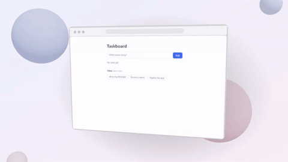
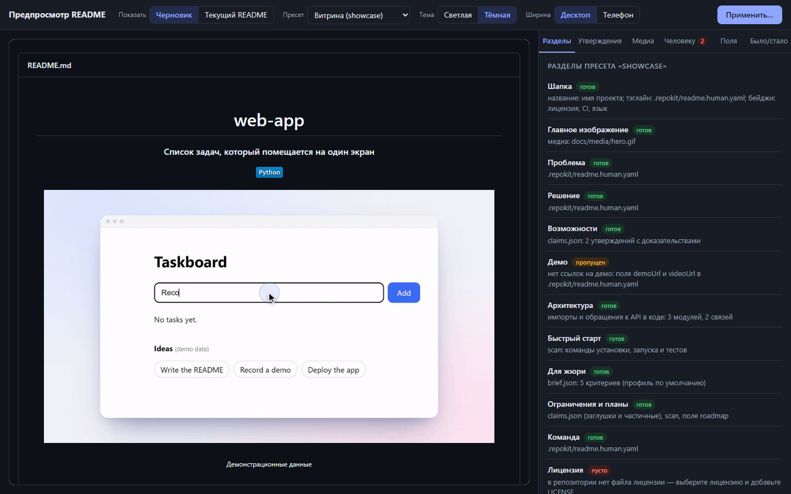

# repokit

Инструменты для честного оформления хакатонного репозитория: набор небольших CLI-сервисов и skill для Claude Code.

Идея простая: README, демо и документация должны показывать только то, что в проекте реально есть.
Поэтому repokit не «пишет красиво», а собирает факты из кода и проверяет каждое утверждение по `файл:строка`.

> **Статус: в разработке, готовы вехи M1–M4 из 8.** Работают анализ репозитория (`scan`), запись веб-демо (`capture`),
> 2D-монтаж и три 3D-пресета (`studio`), разбор правил (`brief`), сборка README (`readme`) и веб-предпросмотр (`preview`).
> Проверка с чистого клона, деплой и безопасные правки кода ещё не реализованы — план и архитектура описаны в [DESIGN.md](DESIGN.md).


*Этот ролик получен командами `capture run` и `studio render` из учебного приложения [examples/web-app](examples/web-app).
Список «Ideas» в кадре — демонстрационные данные самого приложения.*

Та же запись в 3D-пресетах (`studio render --preset …`):

| `laptop-orbit` | `phone-float` | `browser-tilt` |
|---|---|---|
|  |  |  |

*Устройства нарисованы процедурно и не изображают конкретные продукты; на экранах — та же запись и мобильный скриншот из `examples/web-app`.*

## Что уже работает

- **`scan audit`** — определяет тип проекта и стек, команды установки, запуска и тестов, точки входа, роуты (FastAPI, Flask, Express, Next.js, статические страницы), модели данных, места, похожие на заглушки, и замечания по репозиторию (README, лицензия, `.gitignore`, тяжёлые и служебные файлы). См. [packages/scan/src/analyze.ts](packages/scan/src/analyze.ts).
- **`scan claims`** — извлекает утверждения из README, привязывает их к строкам кода и проверяет, что доказательство существует и код с тех пор не менялся. См. [packages/scan/src/claims.ts](packages/scan/src/claims.ts).
- **`scan context`**, **`scan topics`**, **`scan init`** — выжимка репозитория для модели, предложение GitHub topics, создание рабочей папки `.repokit/`.
- **`capture`** — запускает приложение и записывает по сценарию видео, лог событий и скриншоты в настоящем браузере; секреты берутся из окружения, поля с ними размываются. См. [docs/capture.md](docs/capture.md).
- **`studio`** — монтирует запись: фон, окно-рамка, авто-зум по кликам и вводу, сглаженный курсор; выдаёт MP4, GIF в пределах 8 МБ, WebP и постер. См. [docs/studio.md](docs/studio.md).
- **3D-пресеты** — ноутбук, телефон и окно браузера со слотами: выбираете пресет, указываете скриншот или запись, они встают на экран устройства. Пустой слот — ошибка; медиа не из `capture` — предупреждение. Как добавить свой — в [CONTRIBUTING.md](CONTRIBUTING.md).
- **`brief`** — сохраняет правила хакатона и проверяет, что каждый критерий в матрице подтверждён дословной цитатой из них; без правил — типовой набор с явной пометкой. См. [docs/brief.md](docs/brief.md).
- **`readme`** — собирает README на русском (или английском) из проверенных утверждений, фактов `scan`, матрицы критериев и слов автора; три пресета оформления; чужие разделы существующего README сохраняет. См. [docs/readme.md](docs/readme.md).
- **`preview`** — показывает README как на GitHub: веб-интерфейс с темами, шириной, панелью разделов и формой для полей автора; для модели — снимки PNG и список измеримых проблем. См. [docs/preview.md](docs/preview.md).
- **`doctor`** — проверка внешних инструментов (git, ffmpeg, gh, python). Ничего не устанавливает.
- **Общий контракт** — единый JSON-конверт, коды выхода, `--dry-run`, идемпотентная запись, маскирование секретов в любом выводе. См. [packages/core/src](packages/core/src).

## Быстрый старт

Нужны Node.js 20+ и pnpm.

```bash
pnpm install
```

```bash
pnpm build
```

Аудит примера из репозитория (ничего не записывает):

```bash
node packages/cli/dist/bin.js scan audit --repo examples/web-app --dry-run
```

То же в машинном виде:

```bash
node packages/cli/dist/bin.js scan audit --repo examples/web-app --dry-run --json
```

Запись и монтаж демо того же примера. Нужны Google Chrome или Edge, `ffmpeg`, Python и зависимости примера
(`pip install -r examples/web-app/requirements.txt`):

```bash
node packages/cli/dist/bin.js capture run --repo examples/web-app --scenario examples/web-app/demo.scenario.yaml
```

```bash
node packages/cli/dist/bin.js studio render --repo examples/web-app --out docs/media/hero.mp4 --gif
```

Та же запись на экране 3D-ноутбука (подставьте имя папки записи из вывода `capture run`):

```bash
node packages/cli/dist/bin.js studio render --repo examples/web-app --preset laptop-orbit --slot main=.repokit/capture/<запись>/video.mp4 --out docs/media/hero-3d.mp4 --gif
```

Черновик README для того же примера и его предпросмотр в браузере:

```bash
node packages/cli/dist/bin.js readme plan --repo examples/web-app --preset showcase
```

```bash
node packages/cli/dist/bin.js preview serve --repo examples/web-app --open
```



Тесты:

```bash
pnpm test
```

Сквозные тесты с настоящей записью, рендером и сравнением кадров 3D-пресетов с эталонами выключены по умолчанию
и включаются переменной `REPOKIT_E2E_MEDIA=1`.

## Как устроена проверка утверждений

1. `scan claims extract` находит пункты раздела «Возможности» / Features в README и записывает их в `.repokit/claims.json` со статусом `unverified`. README сам по себе доказательством не считается.
2. Claude (или человек) находит код, который реализует утверждение, и указывает файл и строки.
3. `scan claims pin` запоминает хэш этих строк.
4. `scan claims check` завершается с кодом 1, если у «реализованного» утверждения нет доказательства, строк не существует или код изменился после фиксации.

В примере [examples/web-app](examples/web-app) README обещает «умные подсказки на основе ИИ», а эндпоинт возвращает три захардкоженные строки —
`scan audit` показывает это место в списке заглушек.

## Контракт CLI

`repokit <сервис> <команда> [флаги]`

| | |
|---|---|
| `--json` | один JSON-документ в stdout; текст для человека всегда в stderr |
| `--dry-run` | ничего не записывать |
| `--repo <path>` | целевой репозиторий, по умолчанию текущая папка |
| Коды выхода | `0` ок · `1` проверка не пройдена · `2` ошибка использования · `3` нужен человек |

Артефакты складываются в `.repokit/` целевого репозитория. Схемы данных — в [schemas/](schemas).
Сервисы не вызывают LLM и не обращаются к внешней сети: `capture` открывает только адрес из сценария.

## Использование с Claude Code

В корне лежит [SKILL.md](SKILL.md) с рабочим процессом и slash-команда [`/repokit`](.claude/commands/repokit.md).

## Структура

```
packages/core   контракт CLI, схемы, маскирование секретов, работа с .repokit/
packages/scan   анализ репозитория и проверка утверждений
packages/capture запись демо: сценарий, браузер, кадры, лог событий
packages/studio  монтаж: камера авто-зума, композиция Remotion, кодирование GIF/WebP
presets/3d       3D-пресеты: описание, сцена и превью каждого; общий движок слотов в _engine
packages/brief   правила хакатона и матрица критериев
packages/readme  сборка README: слоты, схема архитектуры, слияние с существующим текстом
packages/preview веб-предпросмотр README, снимки и проверки вида
presets/readme   пресеты README и словари заголовков (ru, en)
packages/cli    бинарь repokit
schemas/        JSON Schema для данных между сервисами
examples/       проекты-фикстуры для тестов: статический сайт, FastAPI, Express, CLI
tests/e2e/      сквозные тесты контракта CLI
```

## Ограничения и планы

- Реализованы 4 вехи из 8; остальные сервисы при вызове честно отвечают «ещё не реализован» (код выхода 2).
- Анализ кода основан на эвристиках и регулярных выражениях. Результаты с низкой уверенностью помечены полем `confidence` и требуют проверки.
- `capture` записывает только веб-приложения и только в Chromium; `studio` рендерит около двух минут на 14 секунд ролика, без переходов между сценами.
- 3D-пресетов пока три из шести запланированных; у каждого один слот. Дуэт «телефон + ноутбук», изометрические карточки и терминал — в вехе M8.
- Рендер использует Remotion, лицензия которого бесплатна только для частных лиц, некоммерческих организаций и компаний до 3 сотрудников.
- Предпросмотр README близок к GitHub, но не пиксель в пиксель: нет подсветки кода, эмодзи-кодов и списков задач.
- `brief` не читает PDF; критерии по тексту правил размечает Claude Code или человек, сервис только проверяет цитаты.
- TypeScript-типы пока написаны вручную рядом со схемами, а не генерируются из них.
- Линтер не подключён; в CI выполняются сборка с проверкой типов и тесты.
- Манифест плагина Claude Code появится вместе с остальными сервисами.

Порядок вех — в [DESIGN.md](DESIGN.md), раздел 11.

## Лицензия

[MIT](LICENSE). Зависимости и их лицензии — в [ATTRIBUTION.md](ATTRIBUTION.md).
