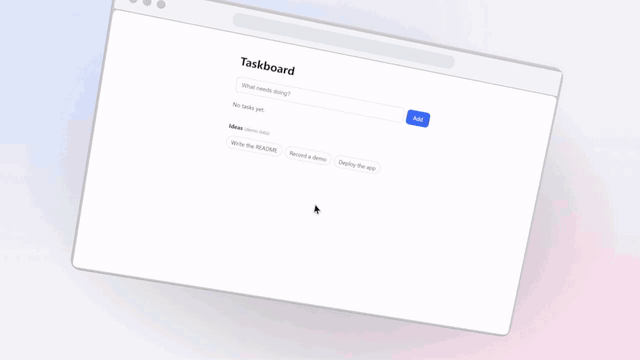
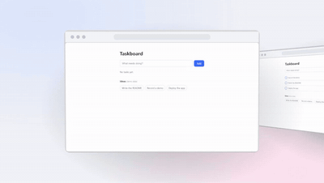
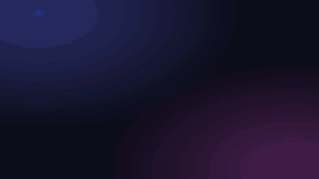

# Режиссёрские 3D-сцены

Сцена — это JSON-файл, в котором вы (или Claude Code) расставляете устройства с настоящими записями, двигаете их,
ведёте камеру и включаете эффекты. В отличие от пресетов, здесь нет заготовленного движения: всё задаётся числами,
которые можно менять и сразу смотреть результат.

На экранах по-прежнему только реальные записи и скриншоты приложения. Камера, движение и эффекты — оформление вокруг них.



## Быстрый цикл

```bash
node packages/cli/dist/bin.js studio scene init --repo examples/web-app --out demo.scene.json
```

```bash
node packages/cli/dist/bin.js studio still --repo examples/web-app --scene examples/web-app/demo.scene.json --at 3.5 --out .repokit/out/look.png
```

```bash
node packages/cli/dist/bin.js studio render --repo examples/web-app --scene examples/web-app/demo.scene.json --out docs/media/hero-3d.mp4 --gif
```

| Команда | Что делает |
|---|---|
| `studio scene init [--capture latest] [--device browser]` | заготовка из последней записи: авто-камера и все эффекты по кликам включены |
| `studio scene validate --scene f` | схема, файлы, длительность, ссылки на объекты |
| `studio still --scene f --at <сек> --out кадр.png` | один кадр за несколько секунд — так проверяется каждая правка |
| `studio render --scene f --out видео.mp4 [--gif] [--webp]` | весь ролик |

Без GPU добавьте `--gl swangle`.

## Готовые постановки для нескольких страниц

Когда хочется показать несколько экранов приложения, сцену не обязательно писать руками:

```bash
node packages/cli/dist/bin.js studio scene make --repo examples/web-app --template carousel --pages shots/home.png,shots/tasks.png,shots/done.png --out pages.scene.json
```



| Шаблон | Что происходит | Страниц |
|---|---|---|
| `carousel` | текущая страница впереди, соседние стоят по бокам вполоборота; ряд сдвигается | 2–8 |
| `stack` | страницы лежат стопкой в глубину; верхняя улетает в сторону, следующая выходит вперёд | 2–6 |
| `swap` | страница уходит влево, разворачиваясь как дверь, справа так же входит следующая | 2–8 |
| `wall` | страницы стоят в ряд; камера проезжает вдоль и останавливается у каждой | 2–8 |
| `duo` | десктопная версия на ноутбуке и мобильная на телефоне рядом | 2 |

Флаги: `--device browser|laptop|phone|screen`, `--background`, `--hold <сек>` (сколько страница стоит впереди),
`--move <сек>` (сколько длится смена), `--out`. Список шаблонов: `studio scene templates`.

Страницы — скриншоты или записи из `capture` (`capture shots`, `capture screenshot`). Результат — обычный файл сцены:
позиции, повороты, камеру и длительность можно править, а потом проверять кадром через `studio still`.
Шаблон ничего не дописывает от себя: подписей в нём нет, на экранах только переданные файлы.

## Координаты

- **Мир.** Единицы условные; экран браузера по умолчанию шириной 4.4. Ось x — вправо, y — вверх, z — к зрителю.
  Повороты `rotation` — в градусах вокруг осей x, y, z.
- **Страница.** Точки (`point`) и рамки (`box`) задаются в **CSS-пикселях записанной страницы** — в тех же, что и лог событий
  `events.json`. Точка `[640, 360]` — центр записи 1280×720. Координаты кликов и рамки нажатых элементов можно взять прямо из лога.
- **Время.** Секунды от начала сцены. `mediaStart` сдвигает начало записи, `mediaSpeed` ускоряет или замедляет её.

## Объекты

```json
{
  "id": "app",
  "device": "browser",
  "media": ".repokit/capture/20261001-172142/video.mp4",
  "events": ".repokit/capture/20261001-172142/events.json",
  "position": [0, -0.4, -2.5],
  "rotation": [14, -38, -3],
  "scale": 0.8,
  "keyframes": [
    { "at": 1.3, "position": [0, 0, 0], "rotation": [0, 0, 0], "scale": 1, "ease": "back" }
  ],
  "cursor": true,
  "effects": { "ripple": true, "sparks": true, "popOut": true }
}
```

| Поле | Значение |
|---|---|
| `device` | `browser` и `screen` принимают форму записи (ничего не обрезается); `laptop` (16:10) и `phone` (9:19.5) подгоняют её по `fit` |
| `position`, `rotation`, `scale` | где объект стоит в начале |
| `keyframes` | движение: в кадре достаточно указать то, что меняется, остальное сохраняется с предыдущего |
| `ease` | как объект приходит в кадр: `linear`, `in`, `out`, `inOut` (по умолчанию), `back` — с небольшим перелётом, «пружиной» |
| `width` | ширина экрана устройства в единицах мира |
| `events` | лог событий записи; нужен для курсора, авто-камеры и эффектов по кликам |

Объектов может быть несколько — например, ноутбук и телефон рядом, каждый со своей записью.

## Камера

Проще всего сказать, **на что** смотреть — `focus`:

```json
{ "at": 3.6, "focus": { "object": "app", "point": [886, 136], "zoom": 2.3, "yaw": 10, "pitch": 6 } }
```

| Поле | Значение |
|---|---|
| `object` | на экран какого объекта смотреть; камера следует за ним, даже если он движется |
| `point` | точка страницы; без неё — центр экрана |
| `zoom` | `1` — экран целиком в кадре; `2` — половина экрана; `0.7` — с полями вокруг устройства |
| `yaw`, `pitch` | на сколько градусов камера отходит вбок и вверх от взгляда прямо на экран |

Это настоящий наезд: камера подъезжает к экрану, рамка окна уходит за край кадра, а соседние элементы остаются видны
под углом. Содержимое не обрезается внутри неподвижной рамки, как в 2D-стиле.

Можно задать камеру и напрямую: `{ "at": 0, "position": [0, 1, 9], "lookAt": [0, 0, 0] }`.

Если писать кадры не хочется: `"camera": { "auto": { "object": "app", "zoom": 2.2, "wide": 0.76 } }` — камера сама
наезжает на каждый клик и ввод и возвращается к общему плану, по тем же правилам, что авто-зум.

## Эффекты

По кликам из лога событий (`effects` у объекта):

| Эффект | Что происходит |
|---|---|
| `ripple` | кольцо в месте клика |
| `sparks` | разноцветные искры разлетаются от клика |
| `popOut` | нажатый элемент приподнимается над страницей перед кликом, продавливается в момент клика и возвращается на место |
| `cursor` | 3D-курсор повторяет записанную траекторию и «нажимает» вместе с кликом. `true` или `"arrow"` — стрелка, `"hand"` — рука с указательным пальцем, `"dot"` — точка, `"ring"` — кольцо; `false` — без курсора |

Поднимается сам элемент, а не его копия: место, с которого он ушёл, закрывается цветом страницы, взятым рядом с элементом,
и под ним остаётся только тень. Содержимое элемента — те же пиксели записи, вырезанные по его рамке из лога событий.
Если элемент стоит на неоднородном фоне (градиент, картинка), заплатка будет заметна — на однотонных страницах её не видно.
Широкие элементы (поля ввода, большие блоки) не поднимаются: это выглядит как сбой, а не как нажатие.

Вручную, в любой момент и в любом месте (`effects` в корне сцены):

```json
[
  { "type": "popOut", "object": "app", "box": [846, 115, 80, 42], "from": 1.5, "to": 3.2, "depth": 0.06 },
  { "type": "sparks", "object": "app", "at": 2.4, "point": [886, 136], "count": 40 },
  { "type": "ripple", "object": "app", "at": 2.4, "point": [886, 136] }
]
```

## Карточки и связи

Кроме устройств, в сцене могут быть **карточки** — плашки со значком и текстом — и **связи** между любыми объектами.
Из них собираются схемы: какие модули есть, кто кого вызывает, куда идёт запрос.

```json
"cards": [
  { "id": "api", "title": "FastAPI API", "subtitle": "app/main.py · роутов: 7", "icon": "fastapi", "position": [-2, 0, 0], "enterAt": 0.6 },
  { "id": "db", "title": "PostgreSQL", "subtitle": "зависимость проекта", "icon": "postgresql", "position": [2, 0, 0], "enterAt": 1.0 }
],
"links": [
  { "from": "api", "to": "db", "at": 1.6, "pulses": [2.2, 3.1] }
]
```

| Поле карточки | Значение |
|---|---|
| `title`, `subtitle` | текст; длинный текст уменьшается, чтобы поместиться |
| `icon` | общий значок (`user`, `browser`, `server`, `database`, `file`, `cloud`, `bolt`, `lock`, `box`, `terminal`, `star`) или логотип технологии по имени из simple-icons (`python`, `fastapi`, `postgresql`, `redis`, `docker`, `react`, …). Список общих: `studio icons` |
| `color` | цвет плитки значка; по умолчанию фирменный цвет логотипа |
| `enterAt`, `exitAt` | когда карточка появляется («пружиной») и исчезает |
| `position`, `rotation`, `scale`, `keyframes`, `width` | как у устройств |

Связь рисуется линией со стрелкой от края одной плашки до края другой с момента `at`; в моменты из `pulses` по ней пробегает
светящийся импульс — так показывается вызов или передача данных. Связи следуют за движущимися объектами.
Камера наводится на карточку так же, как на экран: `"focus": { "object": "api", "zoom": 0.5 }`.

Карточки и устройства можно смешивать: например, слева окно с записью, справа схема того, что в этот момент происходит на сервере.

## Разбор устройства проекта

```bash
node packages/cli/dist/bin.js studio explain --repo examples/web-app
```

```bash
node packages/cli/dist/bin.js studio render --repo examples/web-app --scene examples/web-app/explain.scene.json --out docs/media/how-it-works.mp4 --webm
```



`studio explain` собирает сцену-разбор из кода:

- карточка на каждый модуль, который участвует в обработке запроса: страница, обращающаяся к API, файл с роутами, импортируемые модули;
- связи — настоящие импорты и HTTP-обращения, найденные в исходниках;
- внешние сервисы (PostgreSQL, Redis, MongoDB…) — по объявленным зависимостям. Они показаны как «зависимость проекта»:
  какой именно модуль с ними работает, repokit не утверждает;
- подписи называют реальные файлы и роуты: «Страница обращается к серверу по HTTP: GET /api/tasks, POST /api/tasks…»;
- камера проходит по связям в порядке движения запроса — от пользователя вглубь.

Результат — обычный файл сцены. Его можно дополнить: добавить шаг про конкретную функцию, поставить рядом запись интерфейса,
переписать подпись. Правило то же, что везде: в подписях и карточках только то, что есть в коде. Анализ основан на эвристиках
`scan` — нестандартно подключённые модули могут не найтись, и тогда их нужно дописать вручную.

## Звук

```json
"audio": { "clicks": true, "clickVolume": 0.7, "music": "assets/track.mp3", "musicVolume": 0.25 }
```

или флагами при рендере: `--click-sounds`, `--music <файл>`, `--music-volume <n>`.

- **Щелчки** ставятся на каждый клик записи. Звук синтезируется ffmpeg — звуковых файлов в repokit нет.
- **Музыка** — ваш файл из репозитория: зацикливается или обрезается по длине ролика, плавно входит и затихает в конце.
  repokit музыку не сочиняет и не скачивает; право использовать трек — ваша ответственность, об этом напоминает предупреждение.
- Без этих настроек ролик беззвучный. В GIF и WebP звука не бывает.

## Форматы

`studio render` всегда пишет MP4 и кадр-постер PNG; по флагам — `--gif`, `--webp`, `--webm` (VP9, со звуком в Opus, если он есть).
Один кадр — `studio still`.

## Фон и подписи

`"background"`: `light`, `dark`, `glass`, `sunset`, `mint`, `mono` или свой CSS — `{ "css": "linear-gradient(…)", "captionColor": "#fff" }`.

`"captions": [{ "from": 0.5, "to": 3, "text": "Добавляем задачу", "position": "bottom" }]` — подписи поверх сцены.
Подпись — это утверждение о продукте: пишите в ней только то, что в этот момент действительно видно на экране.

## Проверки

- сцена длиннее записи — ошибка с подсказкой уменьшить `duration` или `mediaStart`;
- камера или эффект ссылаются на объект, которого нет, — ошибка;
- медиа не из `capture` — предупреждение «происхождение неизвестно»;
- эффекты запрошены, а лога событий нет — предупреждение.

## Ограничения

- Искры и кольца — простые фигуры; систем частиц с физикой, свечения и размытия в движении нет.
- Карточки — плашки одного вида; произвольных 3D-фигур и собственных 3D-надписей нет.
- Освещение фиксированное.
- Рендер 14 секунд 1280×720 занимает около двух минут; без GPU — заметно дольше.
